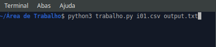
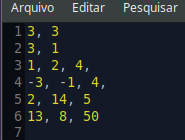

# Metodo de Gauss
Projeto em python para resolver sistemas lineares de matrizes quadradas que foi proposto como um trabalho pela matéria Algoritmos Numéricos.

## Building
Para executar esse projeto é preciso passar dois arquivos como parâmetro, o primeiro com os input e outro para receber as repostas. Segue exemplo:

 

 

## Arquivo input
O arquivo input tem um padrão para o codigo compilar sem erros. A primeira linha é composta pelas dimensões da matriz A, a segunda é composta pelas dimensões da matriz. A partir disso, vem os valores da matriz A separados por virgula e a ultima linha é composta pelos valores da matriz B separados por vigula. Segue exemplo:

 

 
 

É importane frisar que deve ser inserido apenas uma matriz A e uma matriz B e na ordem informada acima.